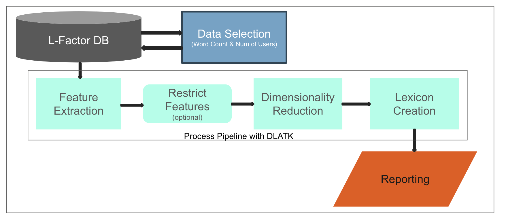

# HLab-L-Factor-Project

This repo contains scripts to generate the L-Factor across multiple domains.

This repo contains 3 scripts:
- Sampling script samples data from the DB per inclusion criteria

    > Usage: python3 sampling_script.py --tables_json tables.json --sample_size 1500 --word_count_threshold 500

- Run script runs the L-Factor Pipeline
    
    > Usage: python3 run.py

- Eval Script runs cross-domain correlations
    > Usage: python3 eval.py

### Presentation: [L-Factor Project](https://docs.google.com/presentation/d/16PSEJ7EJdtefQDfoEbieBoVhjeK-HOWi/edit?usp=sharing&ouid=112463215705421619072&rtpof=true&sd=true)